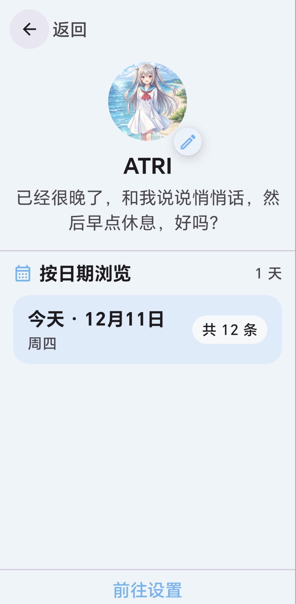
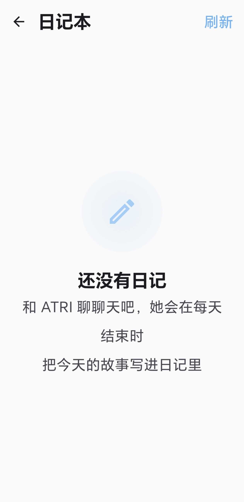
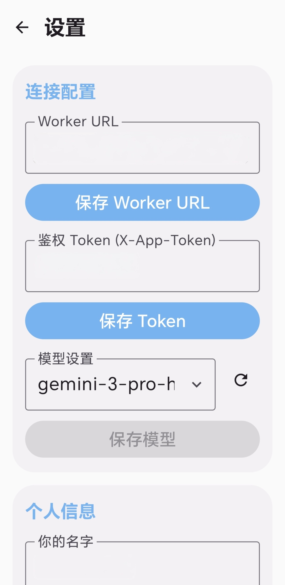

# ATRI - 情感演化型 AI 陪伴项目

> Language: 简体中文 · [English README](README.md)

<p align="center">
  
</p>

<p align="center">
  <strong>「高性能なロボットですから！」</strong>
</p>

<p align="center">
  <a href="#-快速上手">快速上手</a> •
  <a href="#-主要特点">主要特点</a> •
  <a href="#-界面预览">界面预览</a> •
  <a href="#-进一步了解">进一步了解</a>
</p>

---

ATRI 是一个 **Android 应用 + 云端后端** 的 AI 陪伴项目。

简单来说：

> 📱 手机上住着一个会聊天的亚托莉
> 📔 她每天晚上会写一篇日记
> 🧠 日记会变成"记忆"，以后聊天时能回想起来

---

## 🚀 快速上手

### 📋 准备清单

| 需要 | 说明 |
|------|------|
| 一台电脑 | Windows / macOS / Linux 均可 |
| Cloudflare 账号 | 免费注册：https://dash.cloudflare.com/sign-up |
| OpenAI API Key | 或其他兼容 OpenAI 格式的 API |
| Node.js 18+ | 下载：https://nodejs.org/ |
| Python 3.8+ | 下载：https://www.python.org/downloads/ |

### 1️⃣ 部署后端（Cloudflare Worker）

#### 方式一：Windows 一键部署（推荐新手）

1. 双击运行 `scripts/deploy_cf.bat`
2. 按提示依次输入：
   - Worker 名字（直接回车用默认）
   - D1 数据库名字（直接回车用默认）
   - R2 存储桶名字（直接回车用默认）
   - Vectorize 索引名字（直接回车用默认）
   - **OPENAI_API_KEY**（必填，你的 API 密钥）
   - 其他可选密钥（可跳过）
3. 脚本会自动创建资源、配置、部署
4. 完成后复制 Worker 地址（形如 `https://atri-worker.xxx.workers.dev`）

#### 方式二：macOS / Linux 手动部署

```bash
# 1. 克隆项目
git clone https://github.com/你的用户名/ATRI.git
cd ATRI

# 2. 安装依赖
cd worker
npm install

# 3. 登录 Cloudflare
npx wrangler login

# 4. 创建 D1 数据库
npx wrangler d1 create atri_diary
# 复制输出的 database_id，填入 worker/wrangler.toml 的 database_id 字段

# 5. 初始化数据库表
npx wrangler d1 execute atri_diary --file=db/schema.sql

# 6. 创建 R2 存储桶
npx wrangler r2 bucket create atri-media

# 7. 创建 Vectorize 索引
npx wrangler vectorize create atri-memories --dimensions=1024 --metric=cosine

# 8. 设置密钥
npx wrangler secret put OPENAI_API_KEY
# 按提示输入你的 API Key

# 9. 同步提示词
cd ..
python3 scripts/sync_shared.py
# Windows 用户用: python scripts/sync_shared.py

# 10. 部署
cd worker
npx wrangler deploy
```

部署成功后会显示 Worker 地址，例如：
```
Published atri-worker (1.0.0)
  https://atri-worker.你的子域名.workers.dev
```

#### 配置 Secrets（在 Cloudflare 控制台或命令行设置）

| 变量名 | 用途 | 必填 |
|--------|------|:----:|
| `OPENAI_API_KEY` | 聊天模型密钥 | ✅ |
| `EMBEDDINGS_API_KEY` | 向量/嵌入密钥（默认已预置为 SiliconFlow，可自行替换为自己的） | ❌ |
| `APP_TOKEN` | 客户端访问令牌，保护 API 不被滥用 | 建议 |

**通过命令行设置：**
```bash
cd worker
npx wrangler secret put OPENAI_API_KEY
npx wrangler secret put APP_TOKEN
```

### 2️⃣ 安装 Android 客户端

仓库中提供了预编译的安装包：[`app-debug.apk`](app-debug.apk)

直接下载传到手机安装即可。开发者也可以在 `ATRI/` 目录下自行编译。

### 3️⃣ 首次配置

1. **欢迎页**：设置你的昵称和头像
2. **设置页面**（点击右上角齿轮）：

   | 配置项 | 示例 | 说明 |
   |--------|------|------|
   | Worker 地址 | `https://atri-worker.xxx.workers.dev` | 部署后获得的地址 |
   | App Token | `你设置的token` | 与后端 `APP_TOKEN` 保持一致 |
   | 模型 | `gpt-4` | 可按需更换 |

3. 返回聊天页面，开始对话 ✨

---

## ⚠️ 常见问题

### Q: 部署脚本报错 "未找到 node"
**A:** 请先安装 Node.js 18+：https://nodejs.org/

### Q: 部署脚本报错 "未找到 Python"
**A:** 请先安装 Python 3.8+：https://www.python.org/downloads/

### Q: wrangler login 打开浏览器后一直转圈
**A:** 检查网络环境，可能需要科学上网。

### Q: 聊天没有响应
**A:**
1. 检查 Worker 地址是否正确填写
2. 检查 OPENAI_API_KEY 是否有效
3. 在 Cloudflare 后台查看 Worker 日志

### Q: 日记没有生成
**A:** 日记在每天 23:59（北京时间）自动生成，需要当天有对话记录。

### Q: 如何使用其他 AI 服务（如 DeepSeek、Claude 等）？
**A:** 只要兼容 OpenAI API 格式即可：
1. 修改 `worker/wrangler.toml` 里的 `OPENAI_API_URL`（以及可选的 `DIARY_API_URL` / `DIARY_MODEL`）为对应服务的地址/模型
2. 如果向量/嵌入走不同上游，再改 `EMBEDDINGS_API_URL` / `EMBEDDINGS_MODEL`（必要时再配 `EMBEDDINGS_API_KEY`），然后重新部署：`cd worker && npx wrangler deploy`

---

## ✨ 主要特点

| 特性 | 描述 |
|------|------|
| 🎭 **原作人格** | 人格与语气完整复刻，定义于 `shared/prompts.json` |
| 💬 **上下文记忆** | 当天的对话会自动融入后续回复 |
| 📖 **自动日记** | 每晚 23:59（北京时间）生成亚托莉视角的日记 |
| 🧠 **长期记忆** | 日记转化为"回忆"，在需要时自动唤醒 |
| 🖼️ **多媒体支持** | 可发送图片或文档，亚托莉会一起查看理解 |

---

## 🖼️ 界面预览

<table>
  <tr>
    <td align="center"><br/><b>欢迎界面</b></td>
    <td align="center"><br/><b>对话界面</b></td>
    <td align="center"><br/><b>侧边栏</b></td>
  </tr>
  <tr>
    <td align="center"><br/><b>日记界面</b></td>
    <td align="center"><br/><b>设置界面</b></td>
    <td></td>
  </tr>
</table>

---

## 📚 进一步了解

| 文档 | 内容 |
|:-----|:-----|
| [`TECH_ARCHITECTURE_BLUEPRINT.md`](TECH_ARCHITECTURE_BLUEPRINT.md) | 工程架构、数据流、API 设计、扩展指南 |
| [`shared/prompts.json`](shared/prompts.json) | 人格定义、日记生成、记忆系统提示词 |

---

## 🤝 贡献

欢迎提交 Issue 和 Pull Request！

---

## 📄 License

本项目使用 [PolyForm Noncommercial License 1.0.0](LICENSE) 授权（仅限非商业用途）。

---

<p align="center">
  <sub>Built with ❤️ for those who believe AI can be more than just a tool</sub>
</p>
